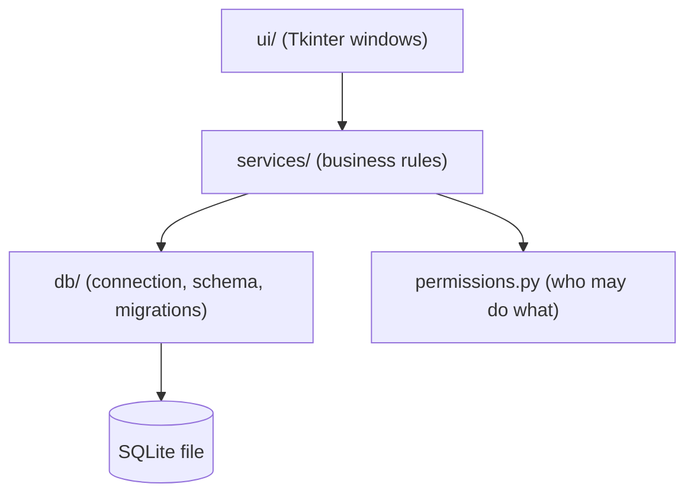
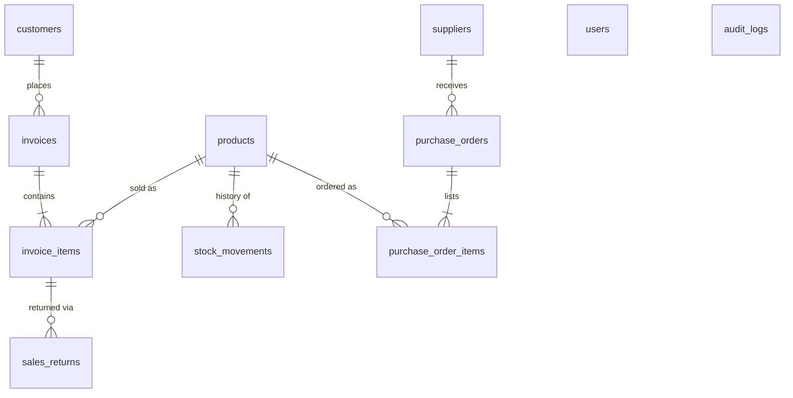

# Architecture

## Layers



* `ui/` only collects input and shows results. It never contains SQL or pricing rules.
* `services/` holds every rule. Each function takes the connection and a `Session`, checks the permission,
  and runs inside one transaction. They raise `errors.POSError` subclasses that the UI turns into dialogs.
* `db/` owns the schema (`schema.py`), pragmas/transactions (`connection.py`) and upgrades (`migrations.py`).

## Folder map

| Path | Purpose |
|---|---|
| `inventory_app.py` | Launcher (`python3 inventory_app.py`); also `python3 -m pos_erp` |
| `pos_erp/config.py` | Paths, limits, payment methods, categories |
| `pos_erp/money.py` | Integer-cent helpers (parse, allocate, format) |
| `pos_erp/security.py` | scrypt hashing, legacy SHA-256 verification |
| `pos_erp/permissions.py` | Role -> permission map and `Session` |
| `pos_erp/services/*` | auth, inventory, stock ledger, sales, returns, purchasing, reporting, backup, audit |
| `pos_erp/ui/*` | Main window, POS tab, inventory tab, dialogs, login |
| `tests/` | unittest suite (services + migration + UI smoke) |

## Data model



## Key decisions

1. **Integer cents.** Floats drift (0.1 + 0.2). All money columns are `*_cents INTEGER`.
2. **Invoices keep snapshots.** `invoice_items` store product name, unit price and unit cost at the time of sale,
   so editing or deleting a product never rewrites history, and profit uses the real cost.
3. **One door for stock.** `stock_service.apply_stock_change` is the only code that modifies `products.stock`
   and it always writes a ledger row. The DB also rejects negative stock (`CHECK stock >= 0`).
4. **Atomic operations.** Checkout, returns, receiving and imports run in one transaction (nested calls use
   savepoints). A failure leaves no half-finished data.
5. **Soft delete.** Products and suppliers are deactivated, not removed, so foreign keys stay valid.
6. **Permissions live in services.** Hiding a button is only a convenience; `session.require(...)` is the rule.
7. **Migrations.** `PRAGMA user_version` tracks the schema. The legacy upgrade backs up the file first and runs
   in a single transaction; IDs are preserved.

## Permissions

| Permission | Admin | Cashier |
|---|:--:|:--:|
| sales.create, inventory.view, barcode.generate, account.update | yes | yes |
| returns.process | yes | no |
| inventory.manage / import / export | yes | no |
| stock.view / stock.adjust | yes | no |
| purchasing.manage | yes | no |
| analytics.view, audit.view, customers.view, system.backup | yes | no |

## Running the tests

```bash
python3 -m unittest discover -s tests -t . -v
```

The UI smoke tests open real (hidden) Tk windows and are skipped when no display is available.

## Manual QA checklist (after UI changes)

1. Login as `admin` -> forced new password -> main window opens.
2. Inventory tab: add a product, edit its stock (reason required), see it in the Stock Ledger.
3. POS tab: add items by barcode and by ID, apply discount and tax, Process Bill, export the receipt.
4. Return / Refund: look up the invoice, refund 1 unit, confirm stock and Net Revenue change.
5. Suppliers -> Purchase Orders: create an order, receive part of it, then the rest, check the ledger.
6. Import CSV: a bad file is rejected with row numbers; a good file shows a preview first.
7. Login as `cashier`: restricted buttons are greyed out.
8. Close the app: a new file appears in `backups/`.

## Not in scope yet

Per-warehouse stock and batch tracking (FEFO), real barcode rendering, loyalty redemption, user management
screen, date-range reports, void invoice, packaging.